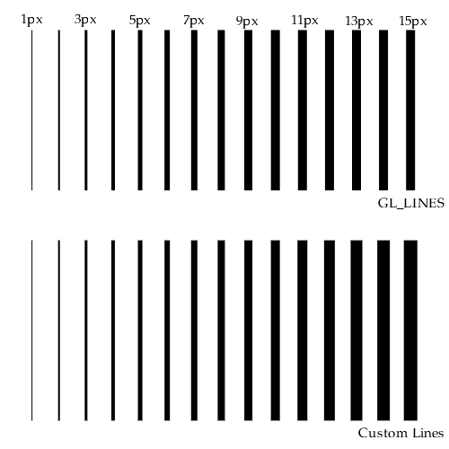
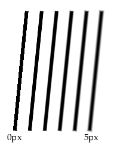
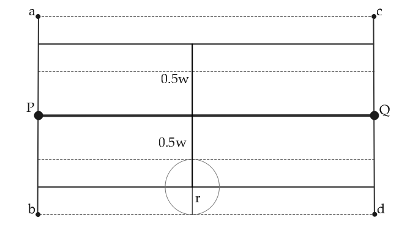
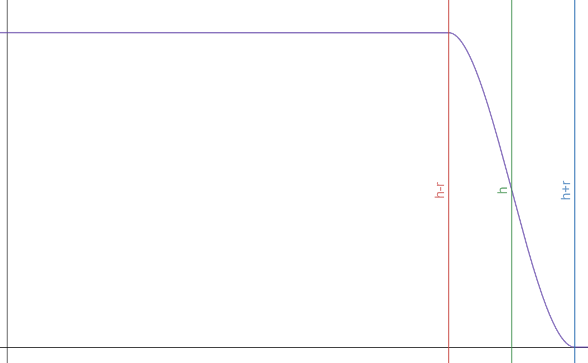
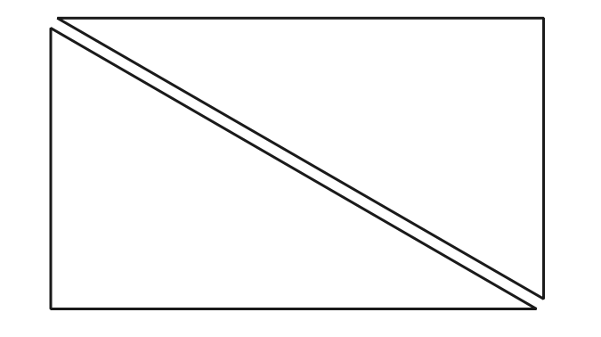
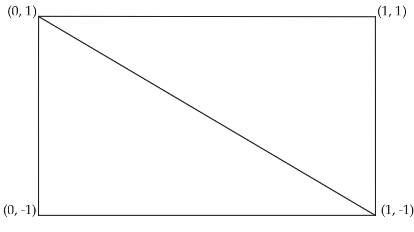

# Lines

<p align="center"> 

</p>

## What?

This repository explores different ways of rendering wide lines using OpenGL. Rather than a library, it is meant to be a
number of reference implementations to produce thick, anti-aliased lines in OpenGL. Currently there are 5 implementations
available in this repo:

1. OpenGL lines - using `glLineWidth(width_value)` functionality.
2. CPU lines - extending lines to quads on the CPU.
3. Geometry Shaders - extending lines to quads on GPU during Geometry Shader stage.
4. Instancing Lines - hijacking the instancing functionality to render a number of line segments by repeating instanced quad.
5. Texture buffer lines - using combination of a texture that stores line data and gl_VertexID to generate quads in Vertex Shader.

For simplicity, the implementation assume vertex buffer where each pair of points creates a line segment (`GL_LINES` behavior)

## Why?

The reason for exploring different implementations of wide line rendering is stemming from the fact that using the build-in OpenGL functionality for this task is very limited, if working at all. While combining `glLineWidth(width_values)` and `glEnable(GL_LINE_SMOOTH)` **"can"** be used to produce anti-aliased lines, there are a number of issues:

- No guarantee that this approach will work. Implementations of OpenGL vary across systems - the `glGet( GL_LINE_WIDTH_RANGE, range)` can simply tell you that your implementation only supports a range (1.0,1.0], leading to effectively no control over the line width. On my system at the time of writing (NVidia GTX 1070 Max-Q, OpenGL 4.5, driver 441.08) the supported `GL_LINE_WIDTH_RANGE` is [1.0, 10.0]. As such I am able to produce image below, but your milage may vary:

- Limited range. As stated above the `glGet( GL_LINE_WIDTH_RANGE, ...)` line width will return supported range - creating lines with widths outside this range will fail. For example, using implementations 1 (using `GL_LINES` + `glLineWidth`) vs other four will produce following images when asking to draw 15 lines segments with widths between 1 and 15 pixels:

<p align="center"> 

</p>

- No control over AA. `glEnable(GL_LINE_SMOOTH)` enables anti-aliasing, however we have no control over this behavior. The custom implementations (2-5) allow user to specify the width of the smoothed region. In the figure below the smoothing radius is varied between 0 and 5 pixels wide:

<p align="center"> 

</p>

- No control over line width within a draw call. Due to the nature of `glLineWidth(width_value)` the line width need to constant within a draw call. This means multiple draw calls needs to be issue to render lines with varying widths. In contrast, the custom implementation expose line width as a per-vertex attribute, allowing to render variable-width
lines with a single draw call.

## Methods

All custom line-drawing methods follow the same baseline paradigm - drawing a quad that is oriented as the line segment, and aligned with the viewport. The gross simplification of the general algorithm is:

1. Transform line segment end points `p` and `q` to normalized device space. At this point we work in 2D space, regardless of whether original line was specified as 2D or 3D line. 
2. Calculate direction `d`, corrected for viewport aspect ratio.
3. Calculate unit normal vector `n = {-d.y, d.x}`
4. Modulate `n` by approperiate line widths to get vectors `n_a` and `n_b` 
5. Create quad points `a = p + n_a`, `b = p - n_a`, `c = q + n_b`, `d = q - n_b`
6. Move points `a`, `b`, `c`, `d` back to clip space and pass them down the rasterization pipeline

The smoothing is done by adding the requested smoothing radius to the user-specified line width, and modifying the alpha value based on the distance from the edge, giving the quad a total width of `w+2r`, as seen below:

<p align="center"> 

</p>

The circle area along the edge at length `w` from the actual line is the area of smoothing, based on ideas from
[Fast Prefiltered Lines](https://developer.nvidia.com/gpugems/gpugems2/part-iii-high-quality-rendering/chapter-22-fast-prefiltered-lines). Essentially, the alpha value will be modulated between 0 and 1 in the region between `h-r` and `h+r`, where `h=0.5w`:

<p align="center"> 

</p>

The falloff is controlled using the GLSL build-in `smoothstep` function. 

Different method vary in terms of how a line segment between `p` and `q` is transformed into such grid. Read on for a brief differences in implementations:


Below we discuss different variants of the method 
### CPU lines
Least efficient implementation, as it simply takes in the buffer of line segments and expands it on CPU side into
quad buffer, and passes it into OpenGL which simply rasterizes the triangles. While it's possible to use array+element buffer in this instance, for simplicity, each quad is represented as two triangles with vertices duplicated:

<p align="center"> 

</p>

In general, this is a decent way to go about it if your OpenGL version does not support any other option.

### Geometry Shader lines
Using geometry shaders is a straightforward extension of the **CPU Lines** approach, simply moving the calculation onto the GPU side. Vertex Shader computes the clip coordinates for both endpoints and passes them to the Geometry Shader stage. The Geometry Shader emits a triangle strip, with 4 vertices per each line segment. This implementation is based on the [Im3D](https://github.com/john-chapman/im3d) work by John Chapman.

### Instancing lines
In this implementation a simple base-quad is drawn for each line segment, and the vertex positions are modulated in the vertex shader. The base-quad has following positions:

<p align="center"> 

</p>

Three buffers are bound in total: one describing the actual quad (array + element buffer), and a buffer describing line geometry. In vertex shader, we get the attributes of endpoints and modify the quad positions accordingly. The idea behind this implementation is explained in [Instanced Line Rendering](https://wwwtyro.net/2019/11/18/instanced-lines.html)

### Texture Buffer lines
This implementation renders the triangles out of thin air using `gl_VertexID`. We ask to render 2 triangles for each line segment and in the Vertex Buffer, based on 'gl_VertexID' we can sample appropriate positions from a texture buffer which stores our line locations. This implementation is loosely based on ideas presented in [OpenGL Blueprint Rendering](http://on-demand.gputechconf.com/gtc/2016/presentation/s6143-christoph-kubisch-blueprint-rendering.pdf)


## Compilation
The project is relatively simple to build. The external dependency not included in this repository is [glfw3](https://www.glfw.org/). You also need a OpenGL 4.5 to run this code, due to usage of OpenGL DSA APIs.

If you have a command line compiler like clang of gcc, and glfw3 is in path, you could simply something similar to this to your terminal (± the OpenGL libs, depending on your system)

```
gcc -std=c11 -I. extern/glad.c main.c -o lines -lglfw3 -lopengl32
```

The source tree also includes a CMakeLists.txt to generate build files, if that's your jam. I only tested it under Msys2, please let me know if you have troubles compiling.

## References
[Im3D; John Chapman '18](https://github.com/john-chapman/im3d)

[OpenGL Blueprint Rendering; Kubisch '16](http://on-demand.gputechconf.com/gtc/2016/presentation/s6143-christoph-kubisch-blueprint-rendering.pdf)

[Fast Prefiltered Lines; Chan & Durand '05](https://developer.nvidia.com/gpugems/gpugems2/part-iii-high-quality-rendering/chapter-22-fast-prefiltered-lines)

[Shader-Based Antialiased, Dashed, Stroked Polylines, Rougier '13](http://jcgt.org/published/0002/02/08/)

[Instanced Line Rendering; Tyrell 19](https://wwwtyro.net/2019/11/18/instanced-lines.html)